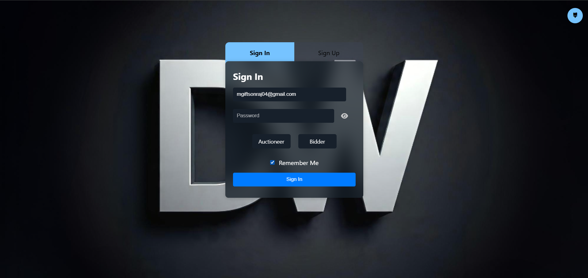

# DealWalker – Real-Time Online Auction Platform

DealWalker is a **real-time online auction web application** where users can **post items for auction and place live bids**.
The platform supports **two roles: Auctioneer and Bidder**, real-time bidding updates, secure authentication, email verification, and automatic auction closing.

The system is built using **Flask, MongoDB, Socket.IO, and GridFS** for scalable real-time auction management.

---

# Project Overview

DealWalker allows users to participate in an online auction system with real-time interaction.




Auctioneers can:

* Post items for auction
* Set starting prices
* Upload item images
* End auctions manually or automatically
* Track auction performance

Bidders can:

* View all active auctions
* Place live bids
* See real-time updates
* Track auctions attended and won

The system uses **WebSockets for real-time bidding updates** and **APScheduler for automatic auction closing**.

---

# Features

### User Authentication

* Secure **Sign Up and Sign In**
* **Email verification using OTP**
* **Password hashing with Flask-Bcrypt**
* **Password reset via email link**

### Role Based Access

Two user roles are supported:

**Auctioneer**

* Post new auctions
* Upload item images
* View posted auctions
* Close auctions
* Delete auctions

**Bidder**

* View active auctions
* Place bids
* Real-time bid updates
* Track auctions attended and won

---

### Real-Time Bidding

* Implemented using **Flask-SocketIO**
* Instant updates when a bid is placed
* Automatic update of highest bid and bidder
* Real-time auction closing notifications

---

### Auction Management

* Schedule automatic auction closing
* Manual auction termination
* Automatic deletion of closed auctions
* Background cleanup of stale auctions

---

### Image Storage

* Auction images stored using **MongoDB GridFS**
* Image resizing using **Pillow (PIL)**
* Cached image delivery for performance

---

### Email Services

* Email verification code during signup
* Password reset link via email
* SMTP email integration using **Flask-Mail**

---

### Profile Management

* User avatar upload
* Profile statistics tracking
* Auction participation metrics

---

# Tech Stack

### Backend

* Python
* Flask
* Flask-Login
* Flask-SocketIO
* Flask-Bcrypt
* Flask-Mail

### Database

* MongoDB Atlas
* GridFS (image storage)

### Real-Time Communication

* Socket.IO
* Eventlet

### Scheduling

* APScheduler

### Image Processing

* Pillow (PIL)

### Frontend

* HTML
* CSS
* JavaScript

---

# Project Structure

```
DealWalker
│
├── app.py
├── templates
│   ├── auth.html
│   ├── home.html
│   ├── auctioneer.html
│   ├── bidder.html
│   ├── forgot_password.html
│   ├── reset_password.html
│
├── static
│   ├── css
│   ├── js
│   ├── images
│
├── .env
├── requirements.txt
└── README.md
```

---

# Installation

### 1 Clone the Repository

```bash
git clone https://github.com/yourusername/dealwalker.git
cd dealwalker
```

---

### 2 Create Virtual Environment

```bash
python -m venv venv
```

Activate:

Windows

```
venv\Scripts\activate
```

Mac/Linux

```
source venv/bin/activate
```

---

### 3 Install Dependencies

```bash
pip install -r requirements.txt
```

---

### 4 Configure Environment Variables

Create a `.env` file:

```
SECRET_KEY=your_secret_key
MAIL_USERNAME=your_email@gmail.com
MAIL_PASSWORD=your_app_password
```

---

### 5 Configure MongoDB

Update your MongoDB connection string:

```python
MongoClient("your_mongodb_connection_string")
```

---

### 6 Run the Application

```bash
python app.py
```

Open in browser:

```
http://127.0.0.1:5000
```

---

# How the System Works

1. Users sign up and verify email using OTP
2. Users log in as **Auctioneer or Bidder**
3. Auctioneers create auctions with images and start price
4. Bidders place bids in real time
5. Highest bid is updated instantly for all users
6. Auction closes automatically at scheduled time
7. Winner is announced and auction is removed after cleanup

---

# Security Features

* Password hashing with **bcrypt**
* Email verification before login
* Token based password reset
* Role based access control
* Session protection

---

# Future Improvements

* Payment gateway integration
* Bid history tracking
* Auction categories and filters
* Real-time chat for auctions
* Mobile responsive UI
* Admin dashboard
* Auction timer countdown

---

# Author

**M. Giftson Raj**

Full Stack Developer

Portfolio Projects

* DealWalker – Real-Time Auction Platform
* ISL Translation Platform (3D Sign Language)
* Pneumonia Detection System
